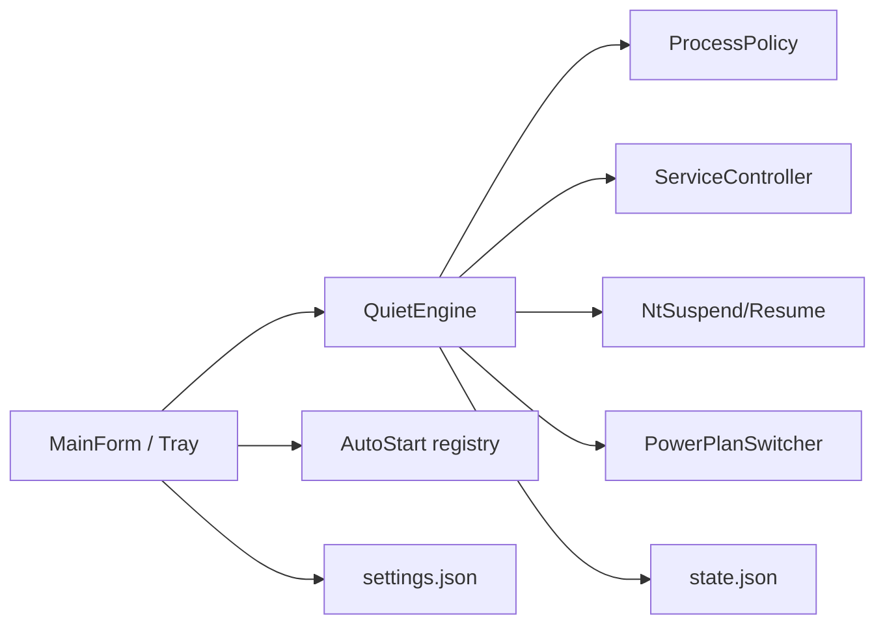

# AI_CONTEXT.md — ComputeQuiet

## System Overview

ComputeQuiet is an elevated Windows WinForms app that parks compute-heavy background work (services, process suspend, optional High Performance power plan) so games/local AI get the machine, then restores prior state via a toggle, including tray and optional Windows startup.

## Tech Stack & Architecture

- .NET 8 WinForms (`net8.0-windows`), `requireAdministrator` manifest, app icon `Assets/ComputeQuiet.ico`
- `ComputeQuiet.Core` — `ProcessPolicy`, `Defaults`, `QuietState`, `AppSettings`, `StateStore`, `SelfCheck`
- `ComputeQuiet` — `MainForm` (tray + settings), `QuietEngine`, `PowerPlanSwitcher`, `AutoStart`
- `ComputeQuiet.Tests` — `SelfCheck` runner

## Component Map

- `ComputeQuiet/Program.cs` — elevation, `--minimized` startup
- `ComputeQuiet/MainForm.cs` — toggle UI, NotifyIcon, settings checkboxes
- `ComputeQuiet/QuietEngine.cs` — enable/disable orchestration
- `ComputeQuiet/PowerPlanSwitcher.cs` — `powercfg` get/set active scheme
- `ComputeQuiet/AutoStart.cs` — HKCU `Run` key
- `ComputeQuiet.Core/StateStore.cs` / `AppSettings.cs` — `%LocalAppData%\ComputeQuiet\`

## Data Flow

1. GO QUIET → optional High Performance plan (save previous GUID) → stop services → suspend processes → `state.json`.
2. RESTORE → resume PIDs → start services → restore power scheme → clear quiet flag.
3. Close with “minimize to tray” hides the form; Exit from tray sets `_allowClose`.
4. Start with Windows writes `ComputeQuiet.exe --minimized` to HKCU Run.

## Recent Context & Decisions

- 2026-09-18: Initial balanced/aggressive quiet + restore.
- 2026-09-18: Added tray, auto-start, power-plan switch, icons/metadata; repo target `Swatto86/ComputeQuiet`.
