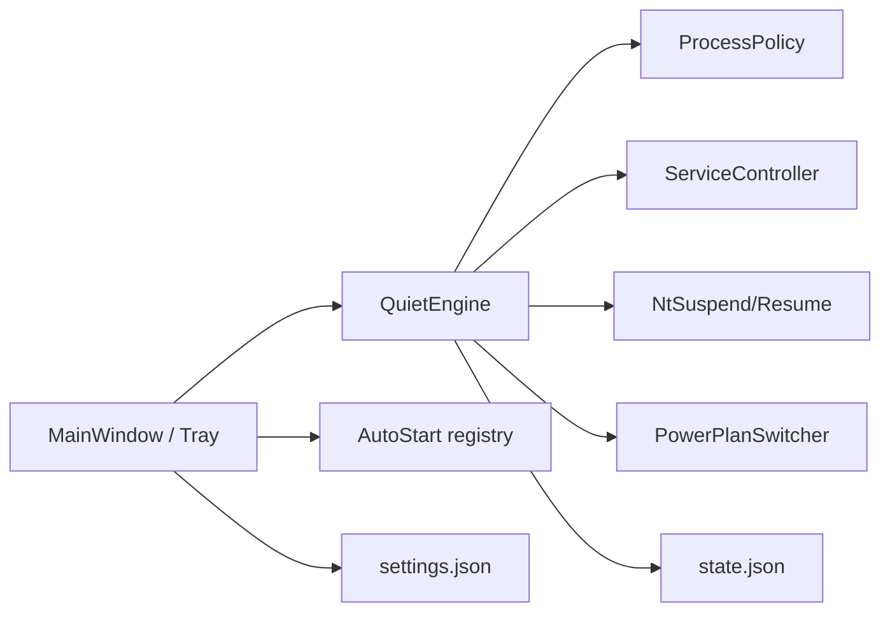

# AI_CONTEXT.md — ComputeQuiet

## System Overview

ComputeQuiet is an elevated Windows WPF app that parks compute-heavy background work (services, process suspend, optional High Performance power plan) so games/local AI get the machine, then restores prior state via a toggle, including tray and optional Windows startup.

## Tech Stack & Architecture

- .NET 8 WPF (`net8.0-windows`) + WinForms `NotifyIcon` for tray; `requireAdministrator` manifest
- `ComputeQuiet.Core` — `ProcessPolicy`, `Defaults`, `QuietState`, `AppSettings`, `StateStore`, `SelfCheck`
- `ComputeQuiet` — `MainWindow` (XAML), `QuietEngine`, `PowerPlanSwitcher`, `AutoStart`, `Program`
- `ComputeQuiet.Tests` — `SelfCheck` runner

## Component Map

- `ComputeQuiet/Program.cs` — elevation, `--minimized`, WPF `App` host
- `ComputeQuiet/MainWindow.xaml(.cs)` — DPI-safe DockPanel/StackPanel layout + tray
- `ComputeQuiet/QuietEngine.cs` — enable/disable orchestration
- `ComputeQuiet/PowerPlanSwitcher.cs` — `powercfg` get/set active scheme
- `ComputeQuiet/AutoStart.cs` — HKCU `Run` key
- `ComputeQuiet.Core/StateStore.cs` / `AppSettings.cs` — `%LocalAppData%\ComputeQuiet\`

## Data Flow

1. GO QUIET → optional High Performance plan → stop services → suspend processes → `state.json`.
2. RESTORE → resume PIDs → start services → restore power scheme → clear quiet flag.
3. Close with minimize-to-tray hides the window; Exit from tray shuts down the WPF app.

## Recent Context & Decisions

- 2026-09-18: Replaced broken Tauri `main` with .NET WinForms prototype.
- 2026-09-18: Converted UI to WPF for High-DPI layout (WinForms absolute coords were squashed).
