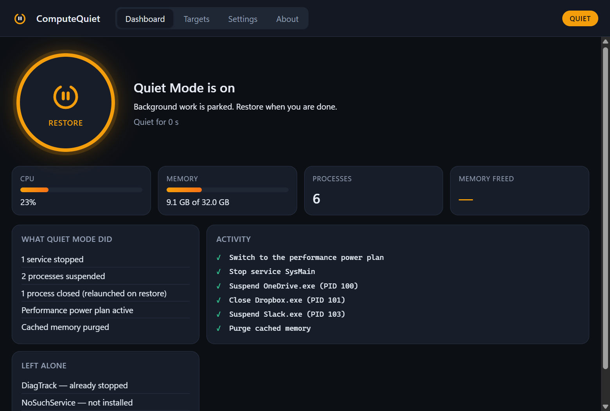
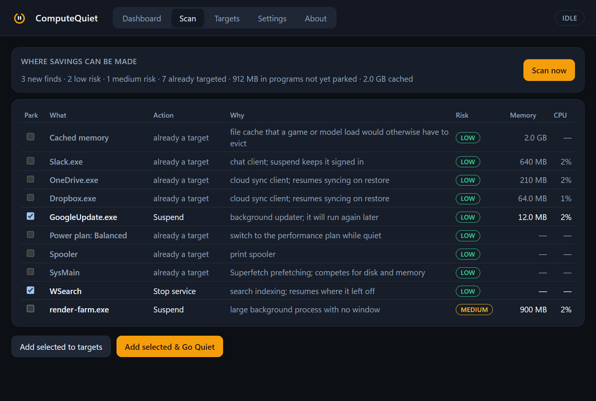

# CompuQuiet

Frees the machine for games and local AI, then puts everything back.

One switch parks the background work that competes for CPU, memory and disk:
telemetry and indexing services, sync clients, updaters, chat apps. It moves
Windows to its performance power plan and purges cached memory once the rest
is out of the way. Switching it off restores every service, resumes or
relaunches every program and returns the power plan, in reverse order. Each
step is written to an undo journal before the next one runs, so a crash or a
reboot cannot lose the list of what to put back.



## What it does

| Action | Windows | Linux | macOS |
| --- | --- | --- | --- |
| Suspend a program (frozen in place, resumed on restore) | `NtSuspendProcess` | `SIGSTOP` | `SIGSTOP` |
| Close a program and relaunch it on restore | `taskkill`, then relaunch | `SIGTERM`, then relaunch | `SIGTERM`, then relaunch |
| Stop a service and start it again | Service Control Manager (administrator) | `systemctl` (polkit for system units, `user:` prefix for user units) | `launchctl` user agents |
| Performance power plan | `powercfg` (Ultimate or High performance) | `powerprofilesctl` | not available |
| Purge cached memory | standby list (administrator) | `drop_caches` via polkit | not available |

The desktop shell, compositor, input, audio, security software, terminals
and CompuQuiet itself are always protected and cannot be added as targets.
Your own "never touch" list sits on top of that.

## Using it

1. Open CompuQuiet. The dashboard shows live CPU, memory and process figures.
2. Open **Scan** to see where savings can be made right now: recognised
   background software that is not yet a target, large programs with no
   window, stoppable services that are running, a non-performance power plan
   and a large file cache. Each row shows its cost, why it is safe and a risk
   level; low-risk rows are pre-ticked. *Add selected & Go Quiet* does both.
3. Review **Targets**: the built-in list of background hogs for your platform,
   with a running/not-running indicator. Add any running program by name,
   choose Suspend or Close & relaunch, add services, and save.
4. Press the big button. With *Scan before going quiet* on (the default),
   the run also parks the low-risk finds without changing your saved targets.
   The activity log shows every step and anything left alone (with the
   reason). The tray icon turns amber while Quiet Mode is on.
5. Press it again, or use the tray menu, to restore. Quitting while quiet
   offers to restore first.



**Windows and administrator rights.** Stopping services and purging memory
need an elevated process. CompuQuiet starts unelevated so it can run at
logon without a prompt; when a target needs elevation the dashboard offers
*Relaunch as administrator*. "Start with the system" registers a logon task,
and when created from an elevated CompuQuiet that task starts it elevated
without a prompt.

**Start with the system** is available on all three platforms (logon task on
Windows, LaunchAgent on macOS, XDG autostart for the Linux AppImage). It
refuses to register a copy running from Downloads, a temporary folder or a
build directory.

## Install

Download from the [GitHub Releases page](https://github.com/Swatto86/CompuQuiet/releases).
Every release ships an installer and a portable build per platform, built by
the `release` workflow from the tagged commit after the full gate passes:

| Platform | Installer | Portable |
| --- | --- | --- |
| Windows 10/11 x64 | `CompuQuiet_<version>_x64-setup.exe` (NSIS, per-user) | `CompuQuiet-portable-windows-x64.exe` |
| Linux x64 | `CompuQuiet_<version>_amd64.deb` | `CompuQuiet-portable-linux-x64` / `.AppImage` |
| macOS (Apple silicon) | `CompuQuiet_<version>_aarch64.dmg` | `CompuQuiet-portable-macos-arm64.app.tar.gz` |

Portable builds keep their settings and undo journal in the normal per-user
configuration folder unless `COMPUQUIET_DATA_DIR` points somewhere else,
for example a folder beside the executable on a USB stick.

Required runtimes (shared platform components, not bundled):

- **Windows:** the [WebView2 Runtime](https://developer.microsoft.com/microsoft-edge/webview2/), present on Windows 11 and updated Windows 10.
- **Linux:** `libwebkit2gtk-4.1` and GTK 3 (the `.deb` declares them; the AppImage expects them installed). `powerprofilesctl` and `pkexec` are optional and enable the power and memory actions.
- **macOS:** nothing beyond macOS 12 or later.

State lives in `%APPDATA%\CompuQuiet` (Windows), `~/.config/CompuQuiet`
(Linux) or `~/Library/Application Support/CompuQuiet` (macOS):
`settings.json` and, while Quiet Mode is on, `journal.json`.

## Building from source

Prerequisites: Rust (pinned in `rust-toolchain.toml`), Node 22+, and the
Tauri platform prerequisites for your OS (MSVC Build Tools on Windows;
`libwebkit2gtk-4.1-dev` and friends on Linux; Xcode command line tools on macOS).

```bash
npm ci
npx tauri dev                 # run with hot reload
pwsh scripts/fastcheck.ps1    # or scripts/fastcheck.sh: fmt, clippy, tsc
pwsh scripts/verify.ps1       # or scripts/verify.sh: the full gate
```

The full gate runs formatting, clippy, Rust and frontend tests, a debug build
with an in-memory fake platform, and a WebdriverIO suite that drives the real
binary through its real webview (Windows and Linux; `scripts/setup-e2e.ps1`
fetches the matching Edge WebDriver on Windows). Packaged installers are built
by `npx tauri build`, which is the release step rather than the inner loop.

## Licence

MIT. See `LICENSE`.
